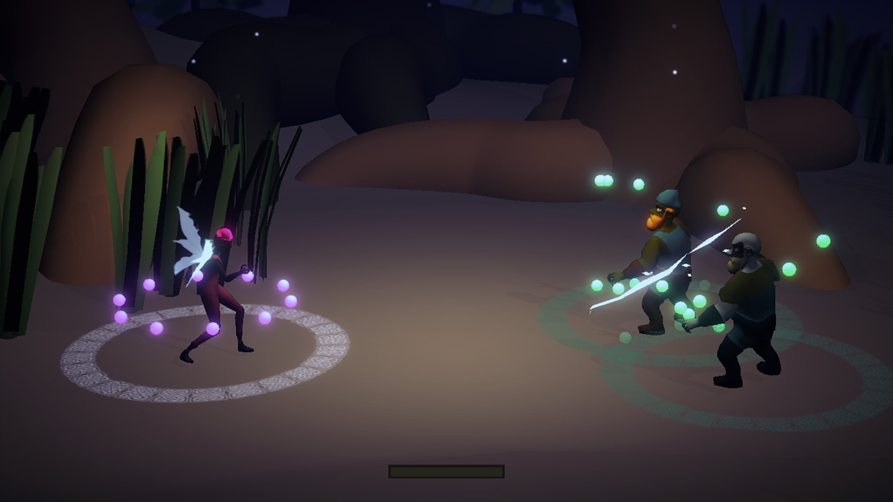
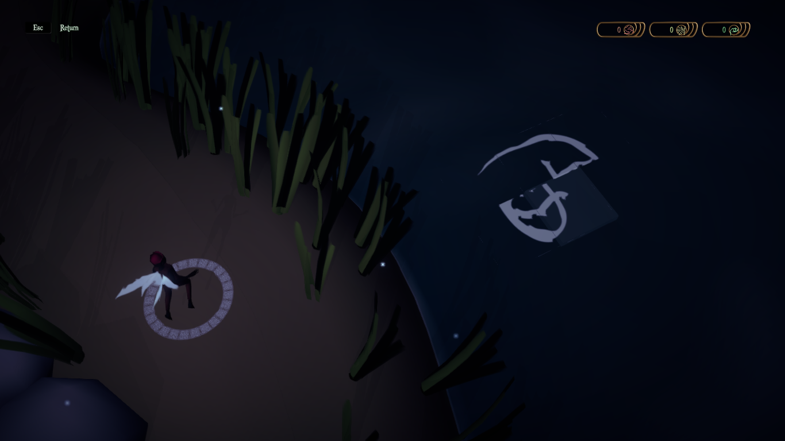
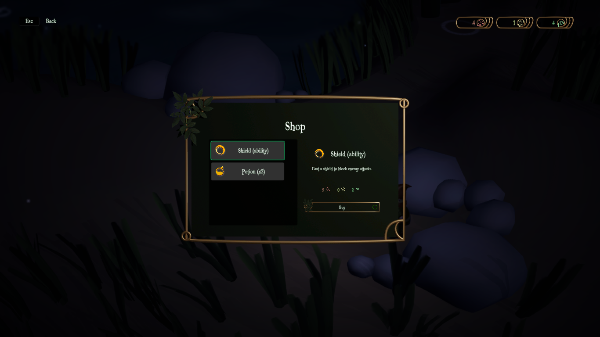
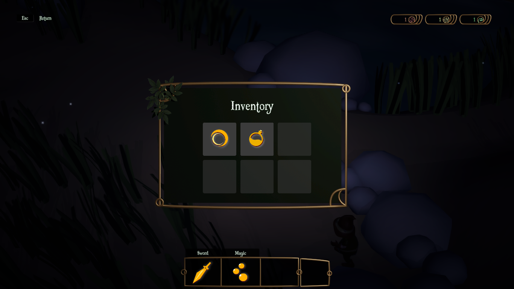

# Magical Light of Kastark

> El mundo está devastado. Los seres mágicos lucharán por restablecer el equilibrio de la naturaleza, y para ello deberán encontrar la Luz Mágica de Kastark.

Kastark es un RPG por turnos con mecánicas de pelea innovadoras.

Hecho en el marco de la [Diplomatura de Diseño, Arte y Programación de Videojuegos](http://www.upc.edu.ar/diplovideojuegos/) dictado en la Universidad Provincial de Córdoba.

- [Descargar (Windows 64)](https://github.com/mauroc8/kastark/releases/tag/1.0)
- [Ver trailer](https://drive.google.com/file/d/15jfz4STtxJ-NR_AQbEWdRZtNjy2IF1QM/view)
- [Ver Pitch Deck](https://drive.google.com/open?id=1-7YJyQOJUfR1vjPWlnizx_mWViXcOrXZwlF2AkUTYMw)

## Incluye

- Batallas por turno contra gnomos.
- 3 habilidades con mecánicas únicas.
- Minijuegos tipo rompecabezas.
- Hadas, gnomos y duendes.

## Capturas

- Gánale a los gnomos quitándoles sus puntos de vida.

  

- Resuelve rompecabezas.

  

- Compra items en la tienda de Dhendé.

  

- ¡Mejora tus habilidades!

  

## Acerca de

Kastark fue desarrollado entre agosto de 2019 y junio de 2020 por un grupo de dos personas:

- **Horacio Alanís.** Diseño y arte. horacio@upc.edu.ar
- **Mauro Cano Brusa.** Diseño y programación. maurocanobrusa@gmail.com

Fue desarrollado usando Unity como *game engine* y Blender para el modelado 3D. El juego está escrito en C#.

## Licencia

Todos los scripts escritos en C# están licenciados con [licencia MIT](https://en.wikipedia.org/wiki/MIT_License).